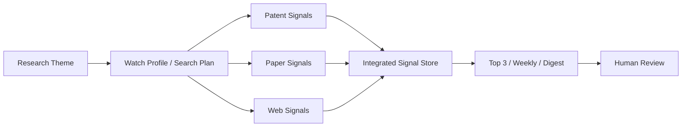

# Tech Cartography

**Technology White Space Discovery & R&D Intelligence Agent**

[](https://github.com/ta9se1E/tech-cartography-v9/actions/workflows/ci.yml)
[](https://www.python.org/)
[](https://tech-cartography-v9-study-demo-utejl5os5a-uc.a.run.app)

製造業・材料R&D向けに、特許・論文・Web情報を同じ研究テーマでつなぎ、今読むべき技術シグナルと次の調査課題を整理する Study Demo です。

AIは法的・技術的判断を自動確定しません。人間のレビューを前提とした研究支援ツールです。

---

## Live Demo

**[Study Demo を開く](https://tech-cartography-v9-study-demo-utejl5os5a-uc.a.run.app)**

| 項目 | 内容 |
|------|------|
| アクセス | ログイン不要（パスワード画面なし） |
| モード | Public Demo / Simple Mode / **read-only** |
| データ | Seeded demo data（共有状態を書き換えません） |
| 対象外 | 法的判断・FTO・侵害・有効性・特許性の判定は行いません |

> Deployment status（r9 validation 時点）: `V9_ACCESS_MODE=public_demo` / `V9_UI_MODE=simple` で Cloud Run に公開済み。push だけでは再デプロイされません。

---

## 30秒で見る使い方

1. **テーマ設定** — 登録済み研究テーマを確認する
2. **情報源** — 特許・論文・Webの件数と品質状態を確認する
3. **注目シグナル** — Top 3 Signals で今読むべき候補を確認する
4. **週次更新 / ダイジェスト** — 変化の見方と次のアクションを確認する
5. **Review** — Public Demo では閲覧のみ（保存・変更はブロック）

画面上部に **Public Demo — read-only** が表示されます。

---

## 解決する課題

- 特許・論文・Webの情報が分散し、同じ研究テーマで横断しにくい
- 件数集計だけでは「何を読むべきか」の判断につながらない
- 重要候補の裏取り（出典・根拠）に時間がかかる
- 一度の調査結果が、継続的な監視・週次レビューにつながらない

---

## 現在できること

実装済み（コード・Demo・テストで確認済み）:

- Theme / Watch Profile / Search Plan / Active Context
- Patent / Paper / Web signal の統合表示
- 情報源別の件数と品質状態
- Top 3 Signals（研究価値カード）
- Weekly baseline
- Digest
- Review / feedback 設計（Public Demo では read-only）
- Source URL / provenance の保持
- Simple Mode UI
- ログイン不要の read-only public judge demo
- GitHub Actions CI/CD（承認付き Deploy）

---

## デモシナリオ

**テーマ:** PAN系炭素繊維用サイジング剤の組成・付与・乾燥条件

| 表示データ | 件数 |
|------------|------|
| Patent | 5 |
| Paper | 5 |
| Web | 5 |
| Integrated signals | 15 |
| Tier A / B / C / D | 3 / 2 / 3 / 7 |

---

## 実装状態

| 区分 | 内容 |
|------|------|
| **実装済み** | 上記の Theme〜Digest / Simple Mode / public judge demo / CI・承認付き CD |
| **Public Demo 上の制限** | read-only（共有データの変更不可）・seeded data・外部実検索・メール送信・Scheduler 変更は無効 |
| **今後の構想** | white-space analysis の深化、継続検索の運用、複数テーマ比較など |

「構想」を実装済みとして扱いません。

---

## システム構成



**CI/CD（実装済み）**

- CI: push / pull request / manual
- Deploy: `workflow_dispatch` + GitHub Environment 承認
- Workload Identity Federation による keyless 認証
- validated release tag を checkout
- offline CI では cloud read/write = 0
- Cloud Build → digest-pinned candidate Revision → candidate URL smoke
- 合格 Revision のみ traffic 100% へ promotion（失敗時 rollback）
- application deploy では Cloud Run IAM を変更しない
- production service を変更しない guard

詳細: [`docs/v9_github_actions_cicd.md`](docs/v9_github_actions_cicd.md)

---

## Trust & Safety / データ方針

- Demo data は presentation 用に seeded / validated
- 論文は supporting evidence candidate であり、技術的真偽の証明ではない
- 特許の FTO・侵害・有効性・特許性判断は行わない
- AI 出力を最終判断に使わず、人間レビューを前提とする
- 架空情報を実情報のように表示しない
- Source URL / provenance を保持する
- Public Demo は read-only（共有状態を書き換えない）
- 外部 API 実行・メール送信・Scheduler 変更は Public Demo で無効

---

## 技術スタック

| 層 | 技術 |
|----|------|
| App | Python 3.11, Streamlit |
| Runtime | Google Cloud Run, Cloud Build, Artifact Registry |
| Storage | Google Cloud Storage |
| CI/CD | GitHub Actions, Workload Identity Federation, Secret Manager |

Provider 連携（BigQuery / OpenAlex / Tavily 等）はコード上実装されていますが、**Public Demo では外部実行を無効化**しています。

---

## ローカル実行

```bash
git clone https://github.com/ta9se1E/tech-cartography-v9.git
cd tech-cartography-v9
python3 -m venv .venv
source .venv/bin/activate
pip install -r requirements.txt
streamlit run app.py
```

- エントリポイント: `app.py` → `ui_v9.signal_watch_app`
- Secret なしでも UI 骨格と offline fixture ベースの確認は可能
- クラウド永続化・外部検索・メール送信には追加設定が必要
- 環境変数の例: [`.env.example`](.env.example)（実 Secret はリポジトリに含めません）

---

## テスト

r9 validation 時点で **1,325 tests passed**。

```bash
bash scripts/run_v9_ci_checks.sh
```

offline CI では `cloud_reads=0` / `cloud_writes=0` / `external_api_calls=0` を確認します。

---

## Repository layout

```
app.py                 # Streamlit entry
services_v9/           # Study Demo / signal / guard / storage
ui_v9/                 # Simple Mode UI
scripts/               # CI・deploy・acceptance
tests/                 # pytest (v9 Study Demo)
.github/workflows/     # CI / Deploy / Rollback
docs/                  # 運用・CI/CD ドキュメント
```

---

## Disclaimer

本リポジトリは研究支援・ハッカソン向けデモンストレーションです。

- 法的助言ではありません
- FTO・侵害・有効性・特許性の判定を行いません
- 出力は人間による検証が必要です
