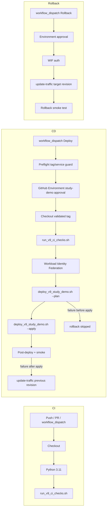

# GitHub Actions CI/CD for Study Demo

This document describes the approved CI and keyless Continuous Delivery foundation for the isolated Study Demo service.

## Architecture

## CI

Workflow: `.github/workflows/ci.yml`

Triggers:

- `push` to `v9-study-demo`
- `pull_request` to `v9-study-demo`
- `workflow_dispatch`

Checks (offline only):

- compileall
- pytest (`tests/test_v9_*.py`, minimum 1108 passed)
- readiness
- build context safety
- simple UI / research value / human-facing safety / final acceptance plan checks

No gcloud auth, no WIF, no secrets, no Cloud writes, no external APIs.

## Approved Continuous Delivery

Workflow: `.github/workflows/deploy-study-demo.yml`

Trigger: **`workflow_dispatch` only**

Inputs:

- `release_tag` (default: `v9-study-demo-final-acceptance-live-validated`)
- `confirm_service` (must exactly match `tech-cartography-v9-study-demo`)

Jobs:

1. **preflight** — tag pattern, service guard, required scripts at tag
2. **deploy** — GitHub Environment `study-demo` approval, checkout validated tag, shared CI checks, WIF auth, deploy plan/apply, post-deploy validation, smoke test, automatic rollback on failure **after apply starts**

Important:

- Push alone never deploys to Cloud Run
- Application source deployed is always the validated tag commit, not the workflow branch tip
- Browser acceptance remains a human step after deploy
- GitHub-hosted runners use setup-python; deploy script selects conda only when the env exists
- Rollback runs only after `Deploy apply` starts; pre-apply failures skip traffic rollback

## Manual rollback

Workflow: `.github/workflows/rollback-study-demo.yml`

Trigger: **`workflow_dispatch` only`

Requires Environment approval, WIF auth, revision validation, traffic switch, smoke test.

## Workload Identity Federation

Setup script: `scripts/setup_v9_github_cicd.sh`

- No Service Account key JSON
- Dedicated deployer SA: `tech-cartography-v9-gh-deploy@devops-ai-agent-hackathon-2026.iam.gserviceaccount.com`
- Runtime SA remains: `tech-cartography-v9-study-demo@...`
- Attribute condition: exact repository + `refs/heads/v9-study-demo`

Deployer SA least-privilege plan:

| Scope | Role |
|-------|------|
| project | `roles/run.sourceDeveloper` |
| project | `roles/serviceusage.serviceUsageConsumer` |
| runtime SA | `roles/iam.serviceAccountUser` |
| deployer SA | `roles/iam.workloadIdentityUser` for WIF principal |

Note: `roles/run.sourceDeveloper` may not include `run.services.updateTraffic`. Verify during setup; add `roles/run.developer` only if rollback traffic updates fail.

## Production isolation

Hard-coded guards reject:

- `tech-cartography-v9-signal-watch`
- any non-Study-Demo service name
- non-validated tag patterns

Deploy and rollback workflows never target production resources.

## GitHub setup (C5B-6B)

User actions (not executed in C5B-6A):

1. Configure `origin` remote and confirm repository visibility
2. Create GitHub Environment `study-demo` with required reviewer
3. Restrict deployment branch to `v9-study-demo`
4. Set Environment Variables (no secrets required):
   - `GCP_PROJECT_ID`
   - `GCP_PROJECT_NUMBER`
   - `GCP_REGION`
   - `CLOUD_RUN_SERVICE`
   - `RUNTIME_SERVICE_ACCOUNT`
   - `WIF_PROVIDER`
   - `DEPLOYER_SERVICE_ACCOUNT` (GitHub rejects variable names starting with `GITHUB_`)
   - `VALIDATED_RELEASE_TAG`
5. Run `bash scripts/setup_v9_github_cicd.sh --apply` after plan review

## Browser acceptance

Automated deploy verifies technical safety (revision, smoke, fixture checks). Final browser acceptance for demo recording remains manual.

## Video Scene 7 wording

Use:

> CIと、承認付きのContinuous Deliveryを実装しました。pushだけではStudy Demoへ自動デプロイせず、validated tag・GitHub Environment承認・Workload Identity Federationによるキーなし認証のあと、preflight/post-deploy/smoke/失敗時rollbackまでを自動化しています。

Do not say:

- 無人のContinuous Deployment
- pushで本番へ自動反映
- production自動deploy
